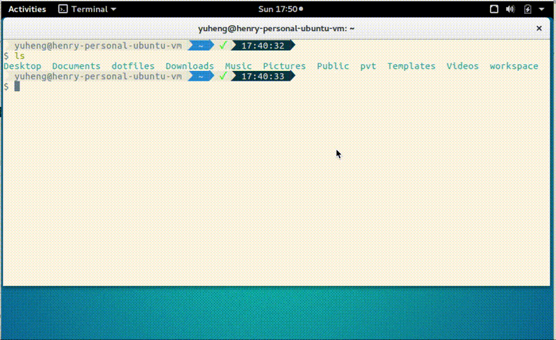

# zsh-interactive-cd

## Demo

## Installation

1. Install [fzf](HTTPS://GitHub.Com/junegunn/fzf) by following its
   [installation instruction](HTTPS://GitHub.Com/junegunn/fzf#installation).

2. Source `zsh-interactive-cd.plugin.zsh` in `.zshrc`.

## Usage

Press tab for completion as usual, it'll launch fzf automatically. Check fzf’s
[readme](HTTPS://GitHub.Com/junegunn/fzf#search-syntax) for more search syntax
usage.
